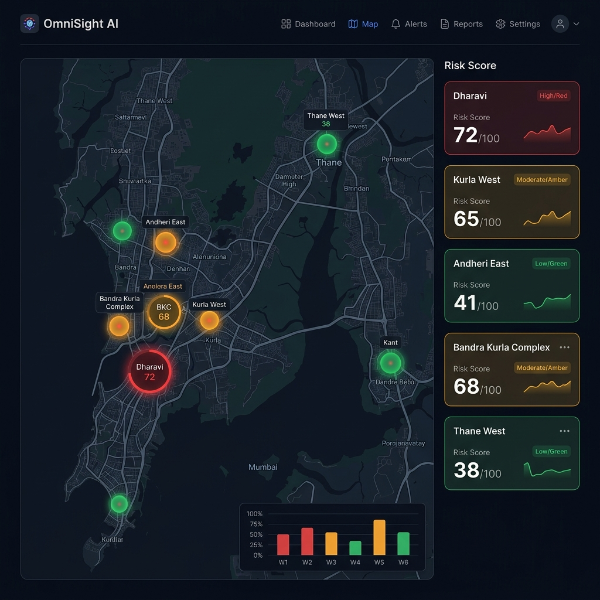
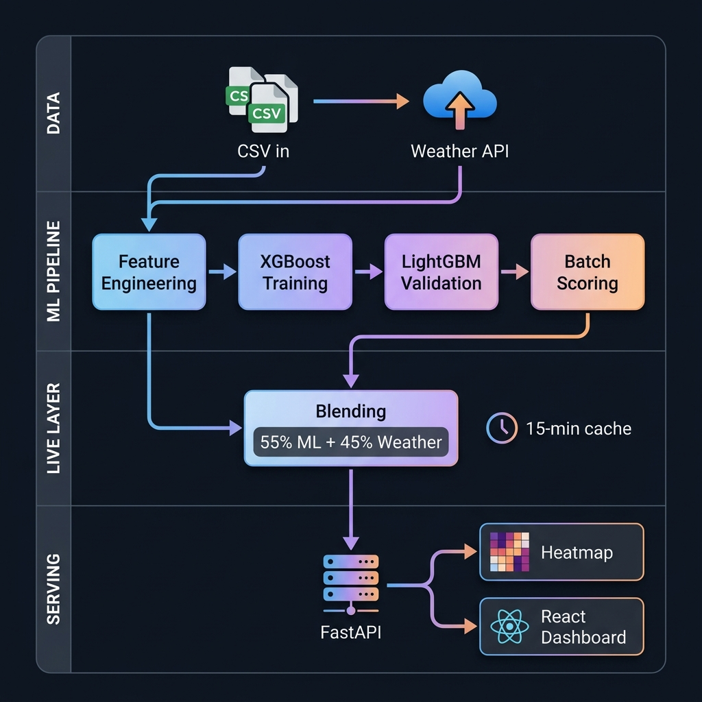
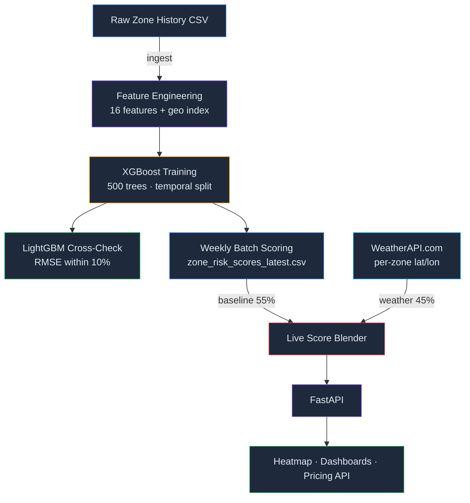

<p align="center">
  
</p>

<h1 align="center">OmniSight AI — Zone Risk Prediction</h1>

<p align="center">
  Real-time ML-powered risk scoring for gig worker safety across Mumbai zones
</p>

<p align="center">
  
  
  
  
</p>

---

## What Is This?

A **0–100 risk score** is computed for each monitored zone in Mumbai by blending two signals:

- **55 %** — XGBoost model trained weekly on historical zone data (floods, curfews, outages, traffic, geography)
- **45 %** — Real-time weather from WeatherAPI.com (rainfall, wind, visibility, storm conditions)

The blended score powers a live risk heatmap, insurance pricing tiers, and safety alerts for gig workers.

<p align="center">
  
</p>

---

## How It Works

<p align="center">
  
</p>



### Weekly Batch Pipeline

Runs every Sunday 23:00 IST. Orchestrated by `src/risk_model/pipeline/weekly_job.py`.

| Stage | What Happens | Output |
|:---|:---|:---|
| **Feature Engineering** | Ingests raw zone history, adds temporal (month sin/cos) and geographic (river proximity, elevation, coastal exposure) features, derives a weighted risk target | `data/features/weekly_zone_features.csv` |
| **XGBoost Training** | Trains a 500-tree regressor on an 80/20 temporal split, evaluates RMSE / MAE / R² | `artifacts/models/risk_xgboost_bundle.joblib` |
| **LightGBM Validation** | Trains a second model on the same split; passes if RMSE is within 10% of XGBoost | `artifacts/reports/validation_lightgbm_vs_xgboost.json` |
| **Batch Scoring** | Runs the trained model over all zones × weeks, clips to 0–100, assigns low/medium/high bins | `data/processed/zone_risk_scores_latest.csv` |

### Live Blending Layer

Runs inside the backend server (`zone_risk.py`), refreshes every 15 minutes.

1. Loads the latest XGBoost baseline scores from the batch CSV
2. Calls WeatherAPI.com for each zone's current conditions (rain, wind, visibility, storm keywords)
3. Converts weather into a 0–100 weather risk score (rainfall 38%, wind 25%, visibility 18%, condition boost 15%, cloud 4%)
4. Blends: **`final = baseline × 0.55 + weather × 0.45`**
5. Caches the result in-process for 15 minutes

### Heatmap

`generate_zone_heatmap.py` produces a self-refreshing Folium/Leaflet HTML map with colour-coded risk circles, heat overlay, and nearest-zone links. Embedded as an iframe in the React dashboards — auto-polls the API every 15 min via injected JS.

---

## Monitored Zones

| Zone | Area | City | Coordinates |
|:---:|:---|:---:|:---|
| `zone_1` | Dharavi | Mumbai | 19.042°N, 72.855°E |
| `zone_2` | Kurla West | Mumbai | 19.073°N, 72.883°E |
| `zone_3` | Andheri East | Mumbai | 19.114°N, 72.870°E |
| `zone_4` | Bandra Kurla | Mumbai | 19.060°N, 72.866°E |
| `zone_5` | Thane West | Thane | 19.185°N, 72.971°E |

---

## Quick Start

```bash
pip install -r requirements.txt

# Run full pipeline (generates sample data if missing)
python -m src.risk_model.pipeline.weekly_job --generate-sample-if-missing

# Start API server
export WEATHER_API_KEY="your_key"
uvicorn api.app:app --reload
```

API docs at `http://127.0.0.1:8000/docs`

---

## API Endpoints

| Method | Endpoint | Description |
|:---:|:---|:---|
| `GET` | `/health` | Health check |
| `GET` | `/risk/latest` | Latest batch-scored risk rows |
| `GET` | `/risk/zones/{zone_id}` | Latest score for a specific zone |
| `GET` | `/risk/heatmap` | Heatmap payload (batch) |
| `GET` | `/zones/risk/live` | **Live** blended scores (ML + weather) |
| `GET` | `/zones/risk/heatmap` | **Live** heatmap payload |
| `GET` | `/plans` | Insurance pricing plans |
| `GET` | `/plans/{plan_id}` | Single plan detail |
| `GET` | `/plans/compare/table` | Plan comparison table |

---

## Fallback Strategy

Every layer has a fallback so the system never returns zero data:

| Layer | Primary | Fallback |
|:---|:---|:---|
| ML Training | XGBoost | sklearn HistGradientBoosting |
| Validation | LightGBM | sklearn RandomForest |
| Live Weather | WeatherAPI.com | Clear-weather defaults |
| Baseline Scores | Batch CSV | Hardcoded geographic baselines |
| Heatmap Data | Live API | Static CSV → Hardcoded values |

---

## Tech Stack

**ML:** XGBoost · LightGBM · scikit-learn · pandas · NumPy  
**API:** FastAPI · Uvicorn · Pydantic  
**Live Data:** WeatherAPI.com  
**Viz:** Folium · Leaflet.js  
**Serialisation:** joblib · PyYAML

---

<p align="center">
  <sub>Built for DevTrails 2026 — Gig Worker Safety</sub>
</p>
